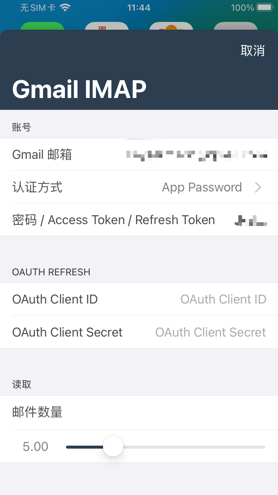
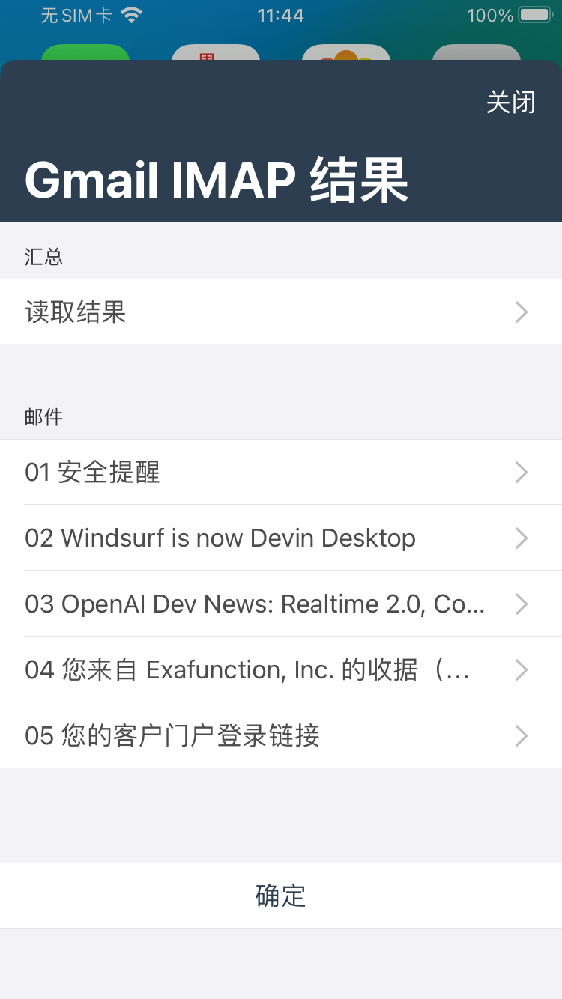

# XXTouch Gmail IMAP 演示脚本

这是一个 XXTouch 单脚本项目，用于演示如何通过 IMAP 协议读取 Gmail 邮件。

项目入口是 `lua/scripts/main.lua`。运行后会弹出配置窗口，填写 Gmail 邮箱、认证方式和读取数量，然后调用 `lua/scripts/gmail_imap.lua` 读取最近邮件，并在结果窗口中展示发件人、时间、主题、正文预览和附件信息。

## 运行截图

<p>
  
  
</p>

## 项目结构

```text
.
├── .config
└── lua
    └── scripts
        ├── main.lua
        └── gmail_imap.lua
```

- `.config`：XXTouch 单脚本项目配置，发布产物为 `.xxt` 加密脚本。
- `lua/scripts/main.lua`：演示入口，负责收集参数和展示结果。
- `lua/scripts/gmail_imap.lua`：Gmail IMAP 读取模块，可拷贝到实际脚本项目中复用。

## 复用 `gmail_imap.lua`

如果你的实际 XXTouch 脚本项目也需要读取 Gmail，可以直接拷贝：

```text
lua/scripts/gmail_imap.lua
```

拷贝到目标项目的 `lua/scripts/` 目录后，在脚本中引用：

```lua
local gmail_imap = require("gmail_imap")

local result, err = gmail_imap.fetch_recent({
  email = "your-account@gmail.com",
  auth_type = "app_password",
  secret = "your-app-password",
  limit = 5,
  mailbox = "INBOX",
  save_dir = XXT_SCRIPTS_PATH .. "/gmail_attachments",
  timeout = 15,
})

if not result then
  sys.alert(err, 0, "Gmail IMAP", "确定")
  return
end

for _, message in ipairs(result.messages) do
  sys.log(message.subject)
end
```

`fetch_recent(opts)` 会返回：

- 成功：`result, nil`
- 失败：`nil, err`

`result.messages` 中每封邮件包含：

- `uid`：Gmail IMAP UID
- `date`：邮件时间
- `from`：发件人
- `subject`：主题
- `preview`：正文预览
- `attachments`：附件列表，每项包含 `filename`、`path`、`mime_type`、`size`、`encoding`

## 认证方式

模块支持三种认证方式：

```lua
auth_type = "app_password"
```

使用 Gmail 应用专用密码。推荐用于演示和简单脚本。需要先在 Google 账号开启两步验证，然后到 https://myaccount.google.com/apppasswords 创建应用专用密码。

```lua
auth_type = "xoauth2"
```

使用已有的 OAuth2 Access Token。`secret` 填 Access Token，不需要带 `Bearer` 前缀。Access Token 通常有效期较短，过期后需要重新生成。

```lua
auth_type = "xoauth2_refresh"
```

使用 OAuth2 Refresh Token 自动换取 Access Token。需要传入：

- `secret` 或 `refresh_token`
- `client_id`
- `client_secret`

这个方式更适合长期使用，但需要你在 Google Cloud Console 创建自己的 OAuth Client。

## 常用参数

```lua
{
  email = "your-account@gmail.com",      -- 必填
  auth_type = "app_password",            -- app_password / xoauth2 / xoauth2_refresh
  secret = "password-or-token",          -- 密码、Access Token 或 Refresh Token
  refresh_token = "refresh-token",       -- xoauth2_refresh 可选，未填时使用 secret
  client_id = "oauth-client-id",         -- xoauth2_refresh 必填
  client_secret = "oauth-client-secret", -- xoauth2_refresh 必填
  mailbox = "INBOX",                     -- 默认 INBOX
  limit = 5,                             -- 读取最近邮件数量，范围 1-50
  save_dir = XXT_SCRIPTS_PATH .. "/gmail_attachments",
  timeout = 15,
}
```

附件会保存到 `save_dir`。本演示脚本默认保存到：

```text
XXT_SCRIPTS_PATH/gmail_attachments
```

## 注意事项

- 不要把 Gmail 登录密码当作 `app_password` 使用；Gmail 需要应用专用密码或 OAuth2。
- 本模块不会持久保存密码、Access Token、Refresh Token 或 Client Secret。
- `main.lua` 只是演示界面；实际项目可以只复用 `gmail_imap.lua`。
- 如果目标项目目录结构不同，请确保 `require("gmail_imap")` 能找到拷贝后的模块。
